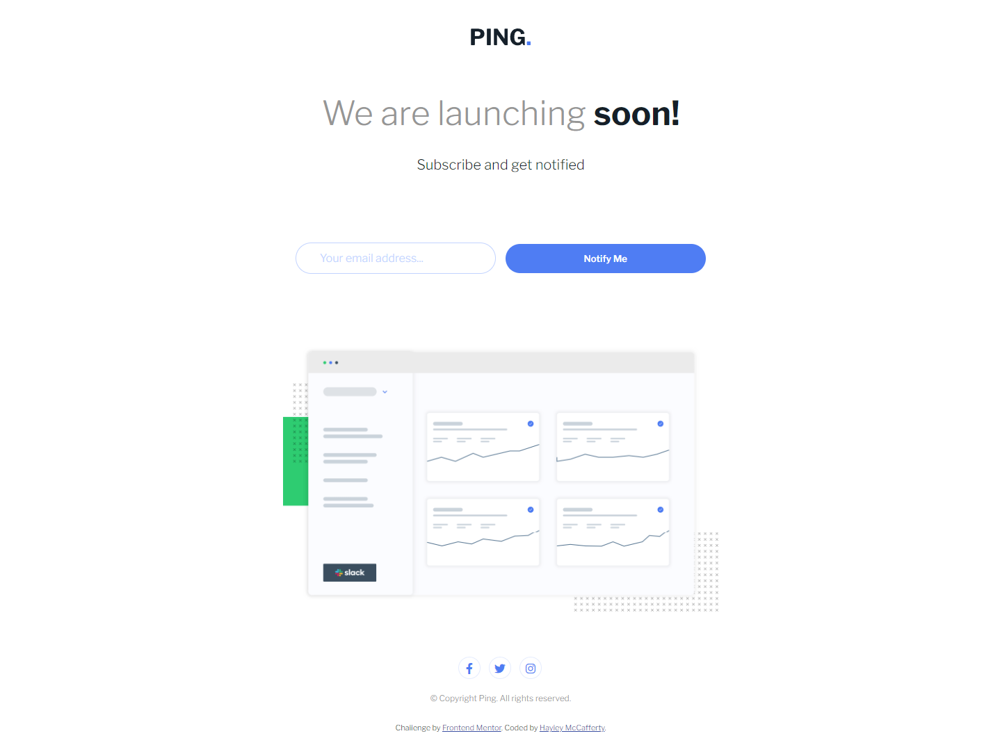
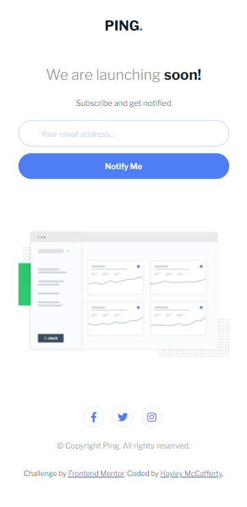

# Ping Single Column Page

Challenge from [Frontend Mentor](https://www.frontendmentor.io/)

## Usage

The purpose of this project was to practice HTML and CSS skills with a design
from Frontend Mentor challenge

## Challenge Description

"This challenge is great for beginners and offers a chance to practice basic
client-side form validation."

## Tech Stack

**Client:** HTML, CSS, JavaScript

## Authors

- [@haylzrandom - GitHub](https://www.github.com/haylzrandom)
- [@haylzrandom - Frontend Mentor](https://www.frontendmentor.io/profile/HaylzRandom)

## Acknowledgements

- [Single Price Grid Component](https://www.frontendmentor.io/challenges/ping-single-column-coming-soon-page-5cadd051fec04111f7b848da)

## Related

Here are some related projects

- [Profile Card Component](https://github.com/HaylzRandom/profile-card-component)
- [Order Summary Component](https://github.com/HaylzRandom/order-summary-component)
- [QR Code Component](https://github.com/HaylzRandom/qr-code-component)
- [NFT Preview Card Component](https://github.com/HaylzRandom/nft-preview-card-component)
- [Stats Preview Component](https://github.com/HaylzRandom/stats-preview-card-component)
- [Single Price Grid Component](https://github.com/HaylzRandom/single-price-component)

## Screenshots

Desktop Screenshot

Mobile Screenshot

